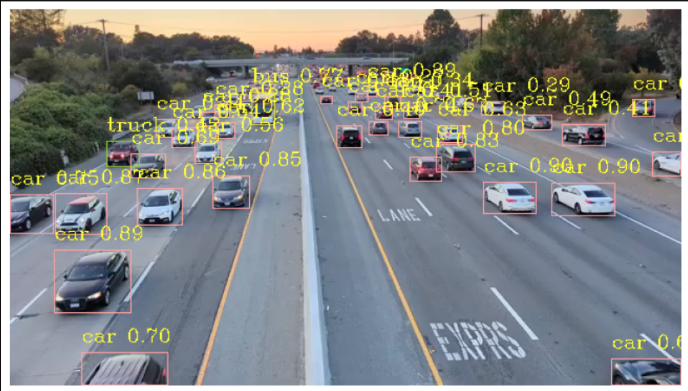
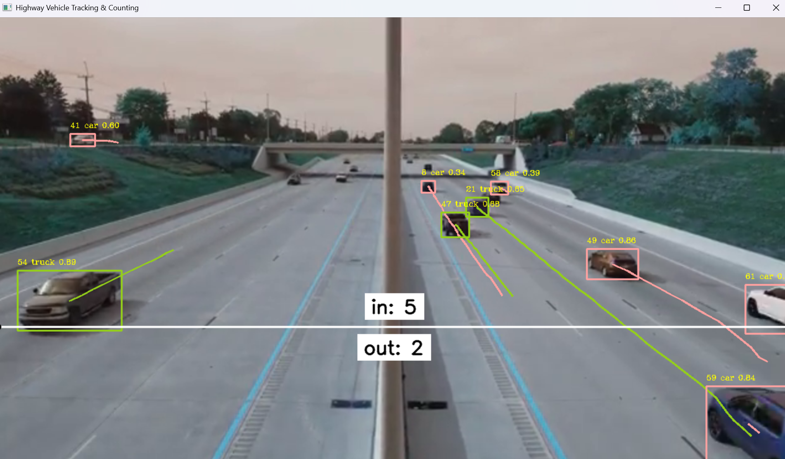

# 🚗 Real-Time Vehicle Detection & Counting

## 📖 Overview
This project performs real-time vehicle detection, tracking, and counting on highway traffic footage using YOLOv8, OpenCV, and Supervision. It identifies vehicles such as cars, motorcycles, buses, and trucks, tracks them across frames, and counts them using a virtual line.

---

## 🎯 Features
- Real-time vehicle detection using YOLOv8
- Object tracking with ByteTrack
- Vehicle counting using line crossing logic
- Bounding box and label visualization
- Trace path visualization for tracked vehicles

---

## 🛠️ Tech Stack
- Python
- YOLOv8 (Ultralytics)
- OpenCV
- Supervision
- NumPy
- Matplotlib

---

## 📂 Project Structure
```bash
project-folder/
│
├── notebooks/
│ └── vehicle_tracking_counting.ipynb
│
├── requirements.txt
├── README.md
```
---

## ▶️ How to Run

### 1. Clone the Repository
git clone https://github.com/AnshulBhaisare/Real-Time-Vehicle-Detection-System.git

### 2. Install Dependencies
pip install -r requirements.txt

### 3. Download Required Files
(Links provided below)

### 4. Place Files
Put downloaded files in the **root project folder** (same location as notebook)

### 5. Run the Notebook
jupyter notebook

---

## 📥 Required Files

### 🎥 Input Videos
- Highway Footage 1:  
https://www.dropbox.com/scl/fi/vgaafi7jg49wys7u2jjqw/Highway-Footage1.mp4?rlkey=vzd3nwihulb2ax67kncokw3om&st=ip1p9kvi&dl=1

- Highway Footage 2:  
https://www.dropbox.com/scl/fi/ydwqjbhaq01nva2c6l310/Highway-Footage2.mp4?rlkey=lix2jltk60fd0acjf6l7f4sqv&st=x06ap8bw&dl=1

---

### 🧠 Model Weights
The model `yolov8x.pt` will be automatically downloaded when running the project for the first time.

---

## ⚠️ Important Notes
- Ensure video files are placed in the correct directory before running the notebook.
- Internet connection is required for first-time model download.
- Press any key to stop the video execution window.

---

## 📷 Results

### Vehicle Detection


### Tracking & Counting


---

## 🚀 Future Improvements
- Add GUI for video input selection
- Optimize performance using GPU
- Deploy as a web application
- Improve counting accuracy with advanced tracking

---

## 👨‍💻 Author
Anshul Bhaisare

---

## ⭐ Acknowledgement
- Ultralytics YOLOv8
- Supervision Library
- OpenCV Community
